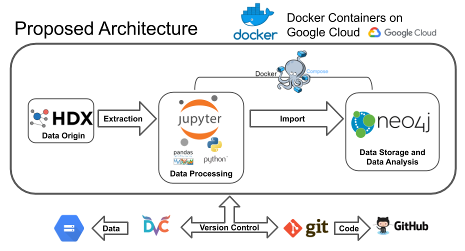

# UNHCRs_population_of_concern_HDX

The objective of this project is to extract worldwide Asylum Seekers' data from [HDX](https://data.humdata.org/), transform it using python, load it into Neo4j and analyse it designing the appropriate queries.

The proposed architecture is based on Docker Containers orchestrated with Docker Compose.  Two docker images will be build, one with python and **Jupyter Notebooks** and another one with **Neo4j**. For reproducibility and version control, GitHub will be used for code and DVC for data.

